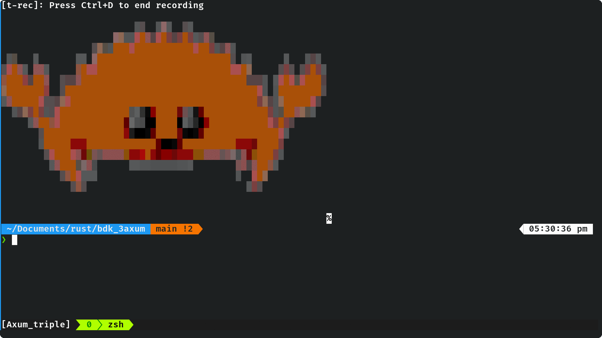

# Learning Rust, Axum, BDK

My bad..I thought BDK needed to use a database...Duh! - That's what the xprv is for!
This code will look ugly, I'll refactor in due course.

BIP44 specifies the structure as consisting of five
predefined tree levels:
    m / purpose' / coin_type' / account' / change / address_index

uses : Bitcoin Testnet + Electrum

- Create Bitcoin Wallet and save xrpv to json (totally insecure, but this is for learning)
- Load wallet from xprv
- Create PSBT + Sign + Broadcast

  Note : tb1 = testnet bech32 addresses / corresponding prefix on mainnet would be bc1

#### https://redandgreen.co.uk/bitcoin-testnet-test-faucet/bitcoin-programming/

#### endpoints
    /
    api/gen_wallet
    api/load_wallet

